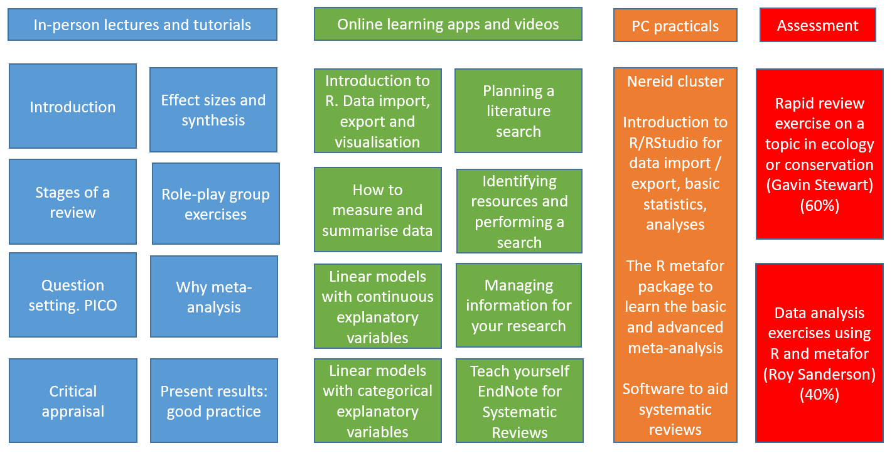

```{r setup, include=FALSE}
knitr::opts_chunk$set(echo = TRUE)
```

# Introduction

This handbook gives you an overview of BIO8075 Critical Thinking and Analysis for Evidence-Based Environmental Science. In particular, it explains the philosophical rationale behind the course, why we believe it is important for those working in ecology, conservation or sustainable agriculture to understand these concepts, and to provide you with insights into the content and structure of the course. First, let us go back in time...

_It is necessary, while formulating the problems of which in our advance we are to find the solutions, to call into council the views of those of our predecessors who have declared an opinion on the subject, in order that we may profit by whatever is sound in their suggestions and avoid their errors._

Aristotle, _De Anima, Book 1, chapter 2_

So, people have realised that it is useful to look at previously published work for centuries in order to build on an existing body of knowledge, even if the concepts of "systematic review" and "meta-analysis" are much more recent. Indeed, whilst it is fairly obvious that, as Issac Newton famously said, we "stand on the shoulders of giants", how do we determine the reliability of previously published research. If this module was running in the year 1020 CE rather than 2020 CE, most European "publications", if they could be called that, categorically stated that the Earth was flat! Fortunately Arabic, Indian and Chinese philosophers had already spotted this was not true.

Modern methods of systematic review and meta-analysis were driven primarily in medicine, especially through organisations such as [Cochrane Collaboration](https://www.cochrane.org/) which was founded in 1993 as a means to improve decision-making in evidence-based medicine. Cochrane Collaboration developed a standard, rigorous protocol for undertaking reviews of the scientific literature, in particular **systematic reviews**. This in turn allowed statistical analyses to be used on the findings of multiple peer-reviewed scientific papers, a process known as **meta-analysis** to distinguish it from conventional statistical models of single studies. These two approaches, systematic reviews, often supplemented by meta-analysis, greatly improved the quality of decision-making in medicine, so that the appropriate life-saving interventions could be implemented. When people's lives depend on making the right decision, a single research paper is insufficient: we need to draw on the whole body of scientific knowledge in an appropriate way.

# Systematic reviews and meta-analysis in ecology, conservation and sustainable agriculture
Whilst the benefits of systematic reviews and meta-analysis have been well-established in medical disciplines, their uptake in environmental science has been much slower, and it is only over the last 5 years that its importance has been recognised. Part of the problem has been poor reporting in the scientific literature of research findings: if Methods and Results are inadequately described, it is difficult to "pool" findings from multiple papers in order to undertake a formal meta-analysis. Most of the books and papers describing systematic reviews and meta-analysis were published from a health or social-science perspective, rather than ecology and biodiversity, and hence often used terminology unfamiliar to scientists from ecology. Most software for managing large bibliographic databases of literature was expensive, and the software for meta-analysis was only available commercially. Whilst many of these problems still exist, recently there have been major changes that benefit ecologists, conservationists and agricultural scientists:

* Availability of substantial texts, and peer-reviewed papers, on the theory and practice of systematic review and meta-analysis, written from the perspective of environmental scientists
* More rigorous requirements by many scientific journals on reporting standards. These vary from making available any code used in the analyses, to free access to the complete datasets used, so that other scientists can repeat the analyses and check the **reproducibility** of the findings.
* High quality open-source (free) systems to manage bibliographic databases. Thus, in addition to commercial software such as [EndNote](endnote.com), public-domain software such as [Zotero](zotero.org) whilst more limited in functionality, can now serve as a suitable alternative
* The free software [R](www.r-project.org) has been in existance for about 25 years, but within the last five years has been improved with some excellent free add-on "packages", in particular the [metafor R package](http://www.metafor-project.org/doku.php) which is as powerful, if not more powerful, than many of its commercial rivals.

# Outline of this course
BIO8075 is split into two main parts, first on systematic reviews, and second statistical modelling / meta-analysis. No prior experience of either is assumed. Whilst most students have done **narrative reviews** as part of their undergraduate degrees, the distinct differences from formal systematic reviews, and the requirements of the latter, and rarely covered. Similarly, most students from a science background (less so from humanities) will have covered basics of statistical analysis as undergraduates. However, experience has shown us that whilst some students may have heard of terms such as 'variance', 'standard error', 'p-values' etc., their actual understanding of these concepts is often tenuous. We therefore provide a refresher on basic statistics, before moving on to meta-analysis.

## Systematic Reviews
### Question formulation
Defining the "question" or "problem" that you are going to study may seem an obvious first step, but doing this rigorously is absolutely critical to all subsequent stages. Often an initial "pilot" search of the literature is needed in this phase: if your question is too narrowly focussed, you will not obtain enough previously published peer-reviewed papers to do a systematic review. If your question is too broad, you will be swamped with papers, often with incompatible aims and objectives. The most common way of defining your question is PICO :

* **P**roblem - who, or what, is being affected? e.g. habitat, species, ecosystem
* **I**ntervention - what is being done? e.g. a management intervention to conserve species
* **C**omparison - what are you comparing with? e.g. a control group that does not receive the intervention, or several different interventions.
* **O**utcome - what do you want to achieve? e.g. improved survivorship

Using the PICO approach helps you in the critical phase of defining your research question. This might be:

* "Does control of grey squirrels by trapping in a 1 km band around a woodland prevent red squirrels becoming infected by parapox virus?"
* "Is survivorship of coral orchid improved by limiting trampling from livestock?"
* "Does grazing by goats reduce the amount of _Juncus_ infestation of semi-natural wet grassland?"

### Literature search
You may be familiar with literature searches using Google Scholar or similar, using a slightly haphazard system to locate papers. However, a proper literature search should be so formalised that it is actually **reproducible**. In other words, if another scientist were to follow the same search strategy that you used, over the same years, same search terms, same databases, same inclusion and exclusion criteria, then they should find the identical set of papers. This sounds totally unrealistic at first, but in practice you are probably familiar with the **Methods** section of a conventional scientific paper, e.g. of a field or laboratory experiment. If the paper is written up correctly, and you follow the described methods for the experiment, you should obtain very similar results. The concept is the same for literature searches, and we will discuss the PRISMA approach to reporting your findings.

### Data evaluation (and extraction)
You need to be able to formally evaluate the findings of the research papers you find. This is the most time-consuming step in the process. Ideally, you should also find a way of extracting information from the papers, and recording this information. If you plan to undertake a formal meta-analysis, then knowing how to extract data, understanding effect sizes, sample sizes etc. is essential.

### Writing and structuring a systematic review
You will learn about best practice in reporting your systematic review, and also how to communicate your findings to potential policy-makers. "Scientists advise, but ministers decide" is the phrase used in UK Government and Civil Service. Many policy-makers are not trained scientists, and may not have time to read overly long, complex reports, therefore it is essential to be able to communicate concisely, precisely, and with clarity.

### Perspectives of different 'actors'
Conservation policy is not made in isolation, and there will be many different interest groups and non-governmental organisations with different, sometimes conflicting, interpretations of the scientific question, and the best outcome. You should consider these issues when developing your question at the PICO stage, and throughout the systematic review process. We will use a 'role-play' exercise to consider the topical issue of neonicotinoid insecticides and pollinators in UK agriculture. The pros and cons of allowing or banning the use of these insecticides are less obvious than might first appear, depending on who you are.

## Meta-analysis
### Introduction to R/RStudio and refresher on statistical concepts
We will use the free R/RStudio software for analyses. This part of the course will introduce you to R/RStudio, how to import data, obtain summary statistics, plot simple graphs etc. We will also provide a refresher on basic statistics for those of you who need a reminder. Interactive online websites will also be available for you to explore some of these concepts, without the need for access to R/Rstudio.

### Basic goal-oriented philosphy
It is possible that as undergraduates you were taught a whole array of different statistical tests, such as t.tests, pairwise t.tests, chi-squared tests, one-way Anova, two-way Anova, analysis of covariance, linear regression, polynomial regression, logistic regression etc. These all fall within the same type of statistical model, namely the **(generalised) linear model**. It is much easier to think in this way. See [this website](https://lindeloev.github.io/tests-as-linear/) for a nice summary of the idea. Broadly, you can think in terms of:

$$\textit{Response variable} = \textit{Explanatory variable(s)} + \textit{noise in data}$$

which can be broken down into:

* **_Response variable_** This is typically equivalent to the 'outcome' in the PICO framework of when you design your question. You might be interested in, for example, whether pollinator biodiversity is greater if neonicotinoid insecticides are prohibited.
* **_Explanatory variable(s)_** This, or these, are broadly equivalent to your 'intervention' in the PICO framework. So a first intervention might be banning of neonicotinoids in some areas, compared to allowing their use in others. (A second intervention might be deliberate planting of wildflowers in one area, compared to no change in another.) We refer to this as an 'explanatory' variable, as it is reasonable to assume that pollinators might be affected by insecticides. Note that your explanatory variable can be measured on categorical scales (e.g. presence or absence of insecticides), or continuous scales (e.g. insecticides at different doses)
* **_noise in data_** Biological data are inherently noisy, in that even if you repeat the an identical survey or experiment, you will obtain subtely different results. You need to be able to **separate the signal from the noise**. The signal we are interested in is the relationship, if any, between the response and explanatory variable. However, we cannot determine the strength of this relationship unless we also measure the noise.

Your response and explanatory variables can be in lots of different forms:

|Response|Explanatory|Comments|
|:-------:|:--------:|:-------:|
|Number of birds present in arable systems| Arable management (conventional/organic)| Response is a whole number count, explanatory categorical with two levels|
|Incidence of large blue butterfly| Abundance of thyme plants in meadow| Response is binary (presence/absence), explanatory continuous scale|
|Body length of great crested newts| Aquatic habitat management (none/clear debris/pond-side planting) | Response is on a continuous scale, Explanatory categorical with 3 levels |

This type of linear or generalised linear model is often summarised algebraically as:

$$Y = X + \epsilon$$
where

* $Y$ is the response variable
* $X$ is one or more explanatory variables
* $\epsilon$ is the Greek letter epsilon, representing noise

Indeed, many people take it one stage further, and we can view it from a **goal-oriented** perspective:

$$\text{goal (Y}\sim{~}\text{X, data = dataset, ...)}$$

where

* **_goal_** This could be a graph, such as a boxplot, scatterplot, barplot. It could be a simple statistic such as a mean or standard deviation. It could be a linear model or a generalised linear model
* **_Y ~ X_** This is your response and one or more explanatory variables.
* **_data = dataset_** You need to provide R with the name of the data that you have imported
* **...** Sometimes you may want to add options to change plotting, or the actual analysis

You can read a nice summary about the goal-oriented approach with respect to [graphics via ggformula here](https://cran.r-project.org/web/packages/ggformula/vignettes/ggformula-blog.html) and [basic statistics via mosaic here](https://projectmosaic.github.io/mosaic/articles/web-only/LessVolume-MoreCreativity.html).

### Moving from conventional analysis to meta-analysis
Conventional data analysis in the form of linear models and generalised linear models etc. is introduced first, as it is important that you have a solid grasp of the basics. In these analyses you are investigating the raw data, you have all the experimental or survey data points, and can thus undertake the analysis in a straightforward manner. In a meta-analysis you **rarely have access to the raw data**. Instead, you have summary information from a number of different papers, and you must "pool" the information from these papers together in a coherent manner before you can undertake the meta-analysis. Critical issues include:

* **Effect-sizes** Often papers will report an intervention as being "statistically significant", i.e. p<0.05, but what is the actual magnitude of that intervention? Policy-makers are often much more interested in how many species will be conserved, at what financial cost, than whether a management intervention is significant or not.
* **Standardised mean differences** Unfortunately it is unlikely that different papers will report the outcome of the intervention in the same way. They might use different units for example. You need to standardise everything so that it is comparable
* **Noise** There are several ways of describing variation in data. Standard error, standard deviation and 95% confidence intervals are the most common. In a meta-analysis, all the noise measurements need to be the same, typically standard error. To convert to standard error, you might also need to study the paper to determine sample size.
* **Data only in graphs** It might be that a paper presents the means and standard errors for various interventions in bar-charts etc., rather than a table. You can sometimes extract this information by scraping it manually or electronically from the figures.

### Different types of meta-analysis
Several routes are available for meta-analysis, and we will focus on the [metafor R package](http://www.metafor-project.org/doku.php) which is freely available and has good document. Key concepts to understand include fixed- and random-effects meta-analysis, and meta-regression to handle continuous interventions. Meta-analysis also allows you to detect "publication bias". For example, it is often suspected that studies that demonstrate "statistical significance" as a result of an intervention are more likely to be published than those that do not. This might be because scientists are less likely to submit papers with non-significant results, the so-called "bottom drawer" effect, and/or because of biases in the journal review system, wanting to promote exciting new findings. Failure to publish non-significant results is most likely to occur in small studies, and meta-analysis provides methods to visualise these problems succinctly.

# Visual overview of the course
The following diagram provides a broad overview of the structure of the BIO8075 course:



The lectures and tutorials, indicated in blue, will be done as in-person sessions and should be in your timetable. Likewise the practicals, indicated in brown, in which you will be using R/RStudio, will be timetabled in a computer cluster. Note that the above diagram gives a simplified overview of the course, in that there are slightly different numbers of lectures and tutorials than illustrated. **More computer classes than expected have been timetabled** especially in the final week of the course: it is possible we will **not** need all these sessions, but the course leader (Roy Sanderson) will keep you updated. Resources are also being made available online (indicated in green), including **interactive web-based apps** to help you with the basics of R/RStudio, strengthen your understanding of statistical concepts, and provide advice on how to plan, undertake, and manage the results of literature searches. These are all be posted on Canvas. The documentation for the R/RStudio practicals will be published onto Canvas in advance of the timetabled computer-cluster sessions. You are strongly encouraged to **look through these in advance** to help you get the most out of the timetabled computer classes.

**Note**: if for health or personal reasons you wish to work through some of the R/RStudio practicals on your own laptop/MacBook rather than attend in-person computer classes then you are free to do so. Please notify snes.bmsc.support@newcastle.ac.uk and roy.sanderson@newcastle.ac.uk of this so Attendance Monitoring can be modified accordingly.

# Assessments
There are two assessments for the course. First a "critical appraisal" set by Gavin Stewart. You will be given access to information on the [Conservation Evidence](https://www.conservationevidence.com/) website on the role of wildflower strips along agricultural fields. Conservation Evidence provides an open portal to available scientific literature and data, and is used by a wide range of environmental and government organisations. You will have to evaluate the evidence on this topic. Second, a meta-analysis exercise, set by Roy Sanderson, in which you will be provided with a variety of datasets from the environmental literature, that you must analyse and interpret. Our aim is that you submit the first exercise at the end of the second week of the course, and the second at the end of the fourth and final week of the course. This will avoid potential clashes with your second block-timetabled course on your degree programme. Full details on both assignments will be made available on Canvas.

# Recommended reading
Three texts that are particularly good and comprehensive include:

* Korichiva et al (2013) Handbook of meta-analysis in ecology and evolution. Princeton
* Borenstein et al (2009) Introduction to meta-analysis. John Wiley
* Cooper et al (2009) The handbook of research synthesis and meta-analysis. Sage Publications

All three are accessible as electronic books via the Canvas website.